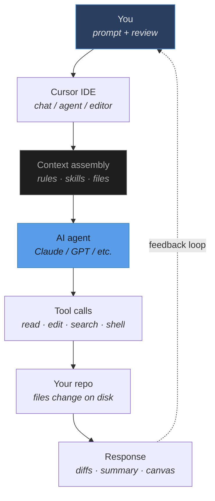

# Working with Cursor on a PhD Thesis

Two layers: how Cursor routes your request through context and tools, and how this repo constrains each agent run to **one drafting task** with a human review loop.

> [!summary] One-liner
> I use Cursor as an AI-native editor with project-specific rules. Each agent run drafts exactly one thesis section from my papers and literature, logs what to verify in a review queue, and stops. I review, build the PDF, fix gaps, and commit. The agent is a disciplined drafter; I am the editor.

---

## How Cursor works (general)

Cursor is an AI-native IDE. When you send a message, the editor assembles context (open files, project rules, skills, terminal state), an agent model plans and executes tool calls against your workspace, then returns edits and a summary. **You stay in the loop** — nothing ships without your review.

**Legend**

| Symbol | Meaning |
|---|---|
| Solid boxes | Standard step |
| Blue boxes | Human action or AI/plan file |
| Grey boxes | Infrastructure layer |
| Dashed arrow | Feedback loop back to you |

### What gets injected as context

- Open & recently viewed files
- **Cursor Rules** (`.cursor/rules/*.mdc`)
- **Agent Skills** (reusable workflows)
- Git status, terminal output
- MCP servers (browser, APIs, etc.)
- User rules (commit policy, style)

### What the agent can do

- Read & search the codebase
- Edit files (creates diffs you accept)
- Run shell commands (sandboxed by default)
- Spawn subagents for parallel exploration
- Produce canvases & structured artifacts
- Ask clarifying questions when blocked

---

## Your thesis workflow (this repo)

> [!info] 1 task per run
> A dedicated Cursor rule (`thesis-drafting-workflow.mdc`) turns the agent into a **section drafter**, not a free-form co-author. Each run completes exactly one item from `THESIS_PLAN.md`, logs it to `REVIEW_QUEUE.md`, and stops. You build the PDF and tick verify boxes; the agent never commits or runs LaTeX.

```mermaid
flowchart LR
    PLAN["THESIS_PLAN.md<br/><i>task queue</i>"]
    PICK["Pick one task<br/><i>deps must be done</i>"]
    IN["Read inputs<br/><i>PDFs · lit · .tex</i>"]
    DRAFT["Draft section<br/><i>chapters/*.tex</i>"]
    BIB["Normalize cites<br/><i>merge into this.bib</i>"]
    QUEUE["REVIEW_QUEUE.md<br/><i>append review item</i>"]
    STOP["Agent stops<br/><i>no commit · no next task</i>"]
    REV["You review<br/><i>verify checklist</i>"]
    BUILD["You build PDF<br/><i>make / latexmk</i>"]

    PLAN --> PICK --> IN --> DRAFT --> BIB --> QUEUE --> STOP
    STOP --> REV --> BUILD
    BUILD -.->|next run| PLAN

    classDef human fill:#2a3f5f,stroke:#599CE7,color:#E4E4E4
    classDef ai fill:#599CE7,stroke:#3685BF,color:#191c22
    classDef infra fill:#1e1e1e,stroke:#555,color:#aaa

    class REV,BUILD human
    class PLAN,DRAFT,QUEUE ai
    class IN,STOP infra
```

### Agent run — step by step

1. **Read `THESIS_PLAN.md` end to end**
   Pick the topmost pending task whose dependencies are done, or a task ID you named explicitly (e.g. `T-CH4-03`).

2. **Mark in-progress, gather evidence**
   Read contribution PDFs, `literature_reviews/*`, and matching PDFs in `literature_reviews/library/`. Never invent citations or numbers.

3. **Draft into the target `.tex` file**
   Follow `chapter-writing-academic-style.mdc`. Use `\TODO{}` for missing evidence, `\NOTEside{}` for missing citations. `Thesis.md` is read-only.

4. **Normalize bibliography**
   Merge BibTeX from the literature pool into `this.bib` with DBLP-style keys. Reuse existing keys; never fabricate entries.

5. **Append `REVIEW_QUEUE.md` item**
   One dated entry per task: what was produced, verify checklist, TODO markers introduced, follow-ups. Newest items at the top of each chapter section.

6. **Update plan status and stop**
   Mark `done`, `done-with-gaps`, or `blocked`. Record `output_notes` + timestamp. Do not pick the next task, commit, or push.

---

## Division of labour

| Agent owns | You own |
|---|---|
| Section drafting from listed inputs | Task planning in `THESIS_PLAN.md` |
| BibTeX normalization into `this.bib` | Reviewing verify checklists |
| `\TODO{}` / `\NOTEside{}` markers for gaps | Resolving those markers |
| `REVIEW_QUEUE.md` logging | LaTeX builds (`make` / `latexmk`) |
| `THESIS_PLAN.md` status updates | Git commits and pushes |
| | Figures, experiments, judgement calls |

---

## Hard guardrails

> [!warning] Enforced by rules — agent cannot

| | Rule |
|---|---|
| ✗ | Edit `Thesis.md`, `models/`, or cover PDFs |
| ✗ | Run `git commit` or `git push` |
| ✗ | Run LaTeX builds |
| ✗ | Fabricate stats, citations, or results |
| ✗ | Generate new figures |
| ✗ | Pick a second task in the same run |

> [!tip] Agent should

| | Rule |
|---|---|
| ✓ | Ask when evidence is missing or scope is ambiguous |
| ✓ | Leave honest `\TODO{}` markers instead of guessing |

---

## Typical session

> [!example]
> You say *"run the next task"* or name a task ID → agent drafts one section → you open `REVIEW_QUEUE.md`, skim the verify list, build `main.pdf`, fix gaps → update `THESIS_PLAN` or queue the next run.

---

## Key files

| File | Role |
|---|---|
| `THESIS_PLAN.md` | Master task list (agent reads first, updates status) |
| `REVIEW_QUEUE.md` | Your review backlog (agent appends one item per completed task) |
| `Thesis.md` | Read-only outline — source of truth for chapter structure |
| `contributions/*.pdf` | Your own papers — empirical evidence and figures |
| `literature_reviews/` | Literature pool (`.md`, `.bib`, `library/*.pdf`) |
| `this.bib` | Bibliography database used by LaTeX |
| `.cursor/rules/thesis-drafting-workflow.mdc` | Rule that constrains agent behaviour |
| `.cursor/rules/chapter-writing-academic-style.mdc` | Academic writing standards for `.tex` |

---

## Sharing this note

- **Obsidian**: open this file directly, or copy it into any vault
- **Export**: use Obsidian's *Export to PDF* or a Mermaid plugin to render the diagrams
- **No Obsidian**: paste the mermaid blocks into [mermaid.live](https://mermaid.live) and export as PNG/SVG
